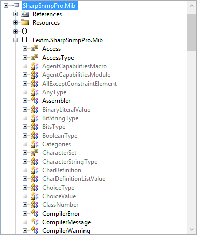

SharpSnmpPro.Mib Assembly Features
==================================

By `Lex Li`_

This page shows you the main features of SharpSnmpPro.Mib assembly.

.. contents:: In this article:
  :local:
  :depth: 1

Background
----------
#SNMP Suite ships with an assembly SharpSnmpLib.Mib which can compile MIB documents and extract some information from them. It only provides limited functionality and users ask for more advanced editions. Here it comes.

The Brand New SharpSnmpPro.Mib Assembly
---------------------------------------
This assembly is the key component that empowers the Compiler Pro product.

Supported Platforms
-------------------
Unlike the Compiler Pro which requires .NET 4.5 and Windows, this assembly can be used on multiple platforms,

* .NET Framework 4.5.2 and above
* Mono 4.2.1 and above
* Xamarin.iOS Unified
* Xamarin.Android
* Xamarin.Mac

Related Resources
-----------------

- :doc:`/support/purchase`
- `Requesting Trial <http://sharpsnmp.com>`_
- :doc:`/getting-started/compiler-features`
- :doc:`/tutorials/assembly-trial-guide`
- :doc:`/tutorials/assembly-full-guide`
