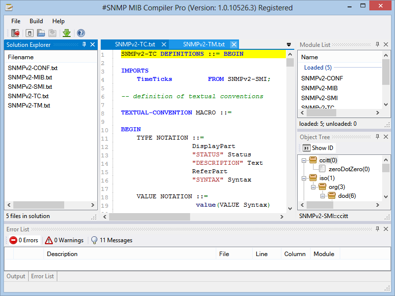
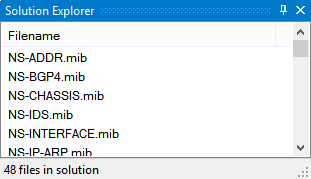
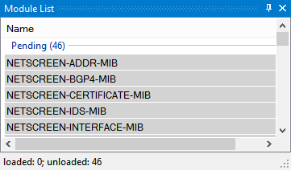
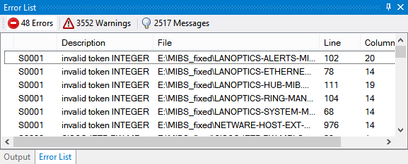
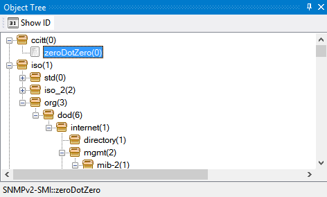

#SNMP MIB Compiler Pro Features
===============================

By `Lex Li`_

This page shows you the main features of the Compiler Pro Edition.

.. contents:: In this article:
  :local:
  :depth: 1

Background
----------
#SNMP Library used to ship a compiler sample project, which only provides limited features such as syntax highlighting. The Pro Edition of #SNMP MIB Compiler, however, is designed and developed to include 
advanced features that target SNMP professionals and enterprises. Support services can be purchased separately.

Supported Platforms
-------------------
The Compiler Pro which requires .NET Framework 4.7.1 and Windows 8.1 and above.

Features
--------

Accurate Error Reporting and Rich Metadata Extraction
^^^^^^^^^^^^^^^^^^^^^^^^^^^^^^^^^^^^^^^^^^^^^^^^^^^^^
Type information extraction is a key requirement of a compiler that for every objects their basic types can be determined (Counter32, OCTET STRING, and so on). Even the intermediate types (such as DisplayString) 
are very useful for troubleshooting. In the meantime, as constraints can be added at each levels, such constraints play an important role in data validation.

#SNMP Compiler Pro can perform cross module dependency resolution, type resolution, and entity validation. Such tasks can provide more accurate error reporting and help identify broken MIB documents.

Based on the metadata collected from MIB documents, the compiler can generate appropriate C# code through compilation, which is similar to Net-SNMP's mib2c utility (who compiles MIB documents to C code). 
The output C# source files can be used to link with the snmpd sample in #SNMP Library so as to form a simulator for those MIB documents.

Visual Studio Style Panels
^^^^^^^^^^^^^^^^^^^^^^^^^^
The compiler is designed to be similar to Visual Studio, with dock panels that show various information to assist MIB document authoring.

Solution Explorer
*****************
MIB documents can be loaded here. Last used solution will be automatically loaded at startup.

Module List
***********
Loaded and pending modules are displayed in this panel, so it is obvious which modules are not compiled.

Error List
**********
Compilation errors and warnings are displayed so it is easy to identify issues in documents.

Object Tree
***********
Objects from loaded modules are displayed so the whole object tree is one click away.

Related Resources
-----------------

- :doc:`/support/purchase`
- `Requesting Trial <https://sharpsnmp.com>`_
- :doc:`/getting-started/assembly-features`
- :doc:`/tutorials/compiler-trial-guide`
