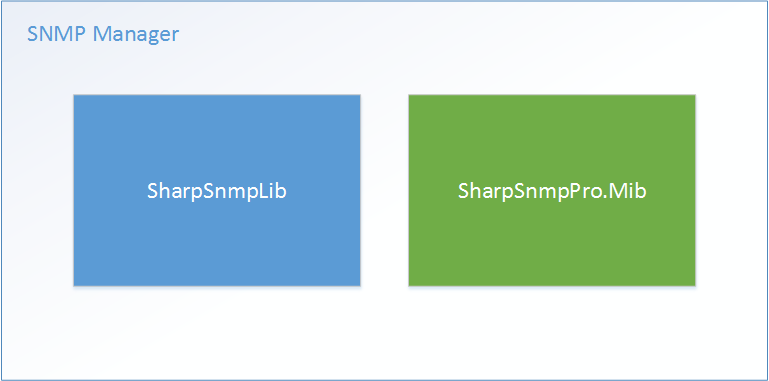

SharpSnmpPro.Mib Assembly Full Version Reviewers' Guide
=======================================================

By `Lex Li`_

This page shows you a guide on SharpSnmpPro.Mib assembly full version.

.. contents:: In this article:
  :local:
  :depth: 1

Background
----------
You learn how SNMP operations can be done by consuming the open source SNMP API. A question then is what values MIB documents provide, as they are said to be an important part 
of SNMP protocol but not seem to be utilized anywhere if we solely use #SNMP Library.

Well, a rough answer is MIB documents mean everything,

* They tell what each object identifiers (OID) mean.
* They tell which OID is for a table, a row, and a column.
* They tell which kind of data we should expect for an object, ``OCTET STRING`` or any other valid types.

Thus, a MIB specific library such as SharpSnmpPro.Mib can help build a much more powerful SNMP manager.

Examples
--------
Now let us see a few examples.

MIB Document Compilation
^^^^^^^^^^^^^^^^^^^^^^^^
The following code shows how to compile several essential MIB documents and load the metadata into memory,

.. code-block:: csharp

  var registry = new SimpleObjectRegistry();
  var collector = new ErrorRegistry();
  registry.Tree.Collector = collector;
  registry.Import(Parser.Compile(new MemoryStream(Resources.SNMPv2_SMI), collector));
  registry.Import(Parser.Compile(new MemoryStream(Resources.SNMPv2_CONF), collector));
  registry.Import(Parser.Compile(new MemoryStream(Resources.SNMPv2_TC), collector));
  registry.Import(Parser.Compile(new MemoryStream(Resources.SNMPv2_MIB), collector));
  registry.Import(Parser.Compile(new MemoryStream(Resources.SNMPv2_TM), collector));
  registry.Refresh();

``SimpleObjectRegistry`` is a class that holds metadata in memory. It can be used to import metadata generated via ``Parser.Compile``. ``ErrorRegistry`` is the container of errors and warnings. When 
``SimpleObjectRegistry.Refresh`` is called, all errors and warnings can be found in the ``ErrorRegistry`` instance, to help you identify why some MIB documents cannot be compiled or imported.

Name/OID Translation
^^^^^^^^^^^^^^^^^^^^
The translation is two-way. You can convert from names to OIDs or vice verse.

.. code-block:: csharp

  const string textual = "SNMPv2-SMI::zeroDotZero";
  var number = new uint[] { 0, 0 };
  Assert.AreEqual(textual, registry.Translate(number));
  Assert.AreEqual(number, registry.Translate(textual));
  
Extract Object Identifier Metadata
^^^^^^^^^^^^^^^^^^^^^^^^^^^^^^^^^^
Once all metadata are loaded in a ``SimpleObjectRegistry`` instance we can easily extract the information for individual objects,

.. code-block:: csharp

  Definition item = registry.Tree.Find("SNMPv2-MIB", "sysDescr");
  IEntity entity = item.DisplayEntity;
  Assert.AreEqual("A textual description of the entity.  This value should include the full name and version identification of the system's hardware type, software operating-system, and networking software.", entity.DescriptionFormatted());
  Assert.AreEqual(EntityStatus.Current, entity.Status);
  Assert.AreEqual(string.Empty, entity.Reference);

  var obj = entity as IObjectTypeMacro;
  Assert.AreEqual(Access.ReadOnly, obj.MibAccess);
  Assert.AreEqual(SnmpType.OctetString, obj.BaseSyntax);

We can see that if we are looking for ``SNMPv2-MIB::sysDescr`` (whose OID is ``1.3.6.1.2.1.1.1``), we can use ``SimpleObjectRegistry.Tree.Find`` method to locate the ``Definition`` instance. Each such instance contains one or 
more ``IEntity`` instances to match their entity definition in MIB documents.

From ``Definition.DisplayEntity`` we can get one of the entities, and check its properties such as ``IEntity.DescriptionFormatted``, ``IEntity.Status``, and ``IEntity.Reference``. 

Since ``SNMPv2-MIB::sysDescr`` is an ``OBJECT-TYPE`` macro entity, we can further cast it to ``IObjectTypeMacro`` to access more properties, such as ``IObjectTypeMacro.MibAccess`` and ``IObjectTypeMacro.BaseSyntax``. It is 
obvious that the data type of ``SNMPv2-MIB::sysDescr`` is ``OCTET STRING``.

There are of course other properties you can review, which are documented online at `the help site`_ . 

.. note:: The Trial version limits which attributes you can see, while the Full version does not have such limitations.

Table Validation
^^^^^^^^^^^^^^^^
With MIB documents, it is very easy to determine if an OID is a table.

.. code-block:: csharp

  var table = new ObjectIdentifier(new uint[] { 1, 3, 6, 1, 2, 1, 1, 9 });
  var entry = new ObjectIdentifier(new uint[] { 1, 3, 6, 1, 2, 1, 1, 9, 1 });
  var unknown = new ObjectIdentifier(new uint[] { 1, 3, 6, 8, 18579, 111111 });
  Assert.IsTrue(registry.ValidateTable(table));
  Assert.IsFalse(registry.ValidateTable(entry));
  Assert.IsFalse(registry.ValidateTable(unknown));

Data Validation
^^^^^^^^^^^^^^^
In SNMP managers or agents, it is a common need to determine if a piece of data is valid for an OID. Various constraints can be defined at MIB document level, but it is often difficult to extract that from the files. With a 
few lines of code you can now do that

.. code-block:: csharp

  Assert.IsTrue(registry.Verify("SNMPv2-MIB", "sysDescr", new OctetString("test")));
  Assert.IsTrue(registry.Verify("SNMPv2-MIB", "sysDescr", new OctetString(string.Empty)));
  Assert.IsFalse(registry.Verify("SNMPv2-MIB", "sysDescr", new Integer32(2)));

We can easily test if the data is valid for ``SNMPv2-MIB::sysDescr``. 

.. note:: The Trial version does only support data validation against a limited set of default types (defined in core MIB documents), while the Full version supports even custom types such as ``BITS``, ``CiscoRowOperStatus``, and ``CiscoPort``.

Complete Sample Project
^^^^^^^^^^^^^^^^^^^^^^^
The Full version is sent to registered users only via emails, and is packaged up with latest #SNMP Library. So below are the assemblies in the ZIP package,

* SharpSnmpPro.Mib.dll
* SharpSnmpLib.Full.dll
* SharpSnmpLib.Portable.dll

To test it out, we reuse the default test projects for Trial version, which can be found at `GitHub <https://github.com/lextm/sharpsnmppro-sample.git>`_. It can be cloned to a local folder, such as ``D:\sharpsnmppro-sample`` .

.. code-block:: shell

  git clone https://github.com/lextm/sharpsnmppro-sample.git

Then the assemblies can be copied to that folder (``D:\sharpsnmppro-sample`` for example).

``Tests.csproj`` is an NUnit project that shows the below,

* How to compile and load MIB documents.
* How to query entity by name.
* How to check description of entities.
* How to verify data against entities. (note that the trial edition only support simple entities, while the full edition supports all entities).
* How to check OBJECT-TYPE macro specific properties.

To make the test project work with Full version, the following changes need to be made,

1. Remove the original reference to ``SharpSnmpPro.Mib.Trial.dll``.
1. Add a new reference to ``SharpSnmpPro.Mib.dll``.
1. Modify ``sharpsnmppro.txt`` following the instructions in the email.
1. Remove ``TRIAL`` from "Conditional compilation symbols", which then enables Full version only test cases.

The API reference documentation can be found at `the help site`_ .

.. _the help site: http://help.sharpsnmp.com
