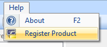
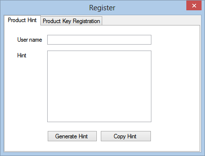
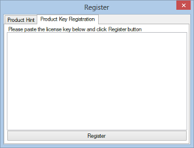

#SNMP Compiler Pro Full Version Reviewers' Guide
================================================

By `Lex Li`_

This page shows you a guide on #SNMP Compiler Pro Full version.

.. contents:: In this article:
  :local:
  :depth: 1

Background
----------
Once you finish the purchase, please follow the these steps to request a license file to activate the compiler. This license file converts the Trial version to Full version.

Generate License Hint
---------------------
1. Launch the compiler by double clicking Compiler.exe.
1. Go to Help | Register Product menu item.
1. In Register dialog, fill in the User name field and click Generate Hint button. The hint data will be generated in the Hint field.
1. Click Copy Hint button to copy the data to clipboard.
1. Exit the Register dialog by clicking the red cross on top right corner.

Please paste that data to an email and send to `the support team <mailto:support@lextm.com>`_ .

License Activation
------------------
Once the license key arrives via email, it is time to perform the following steps to get the compiler activated,

1. Launch the compiler by double clicking Compiler.exe.
1. Go to Help | Register Product menu item.
1. In Register dialog, switch to Product Key Registration tab.
1. Paste the license key to the text box and click Register.
1. Exit the Register dialog by clicking the red cross on top right corner.

Related Resources
-----------------

- :doc:`/getting-started/compiler-features`
- :doc:`/tutorials/compiler-trial-guide`
- :doc:`/tutorials/assembly-trial-guide`
- :doc:`/tutorials/assembly-full-guide`
