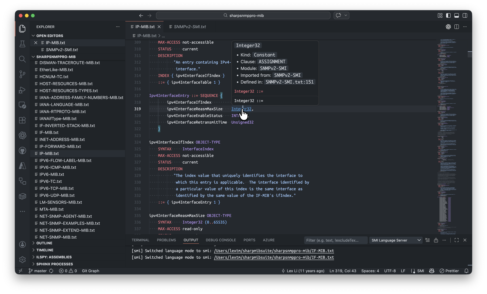
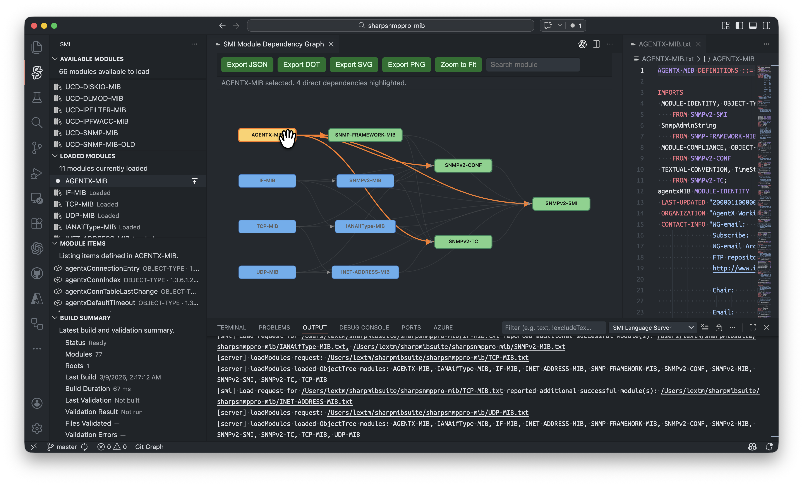
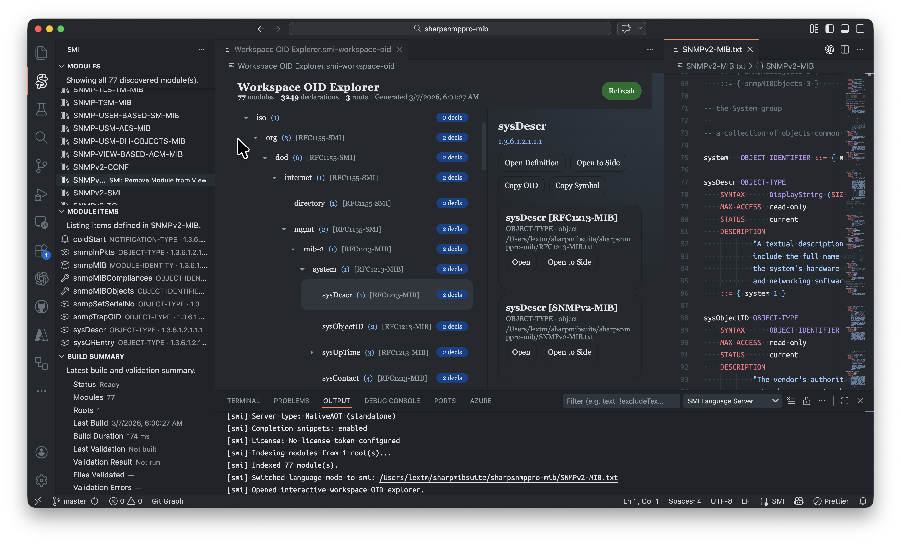
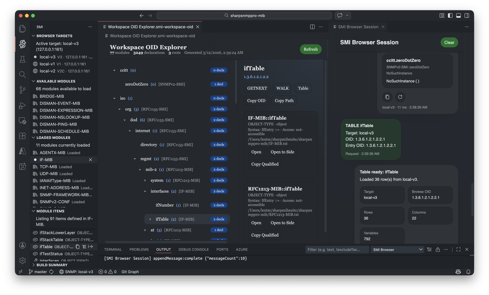
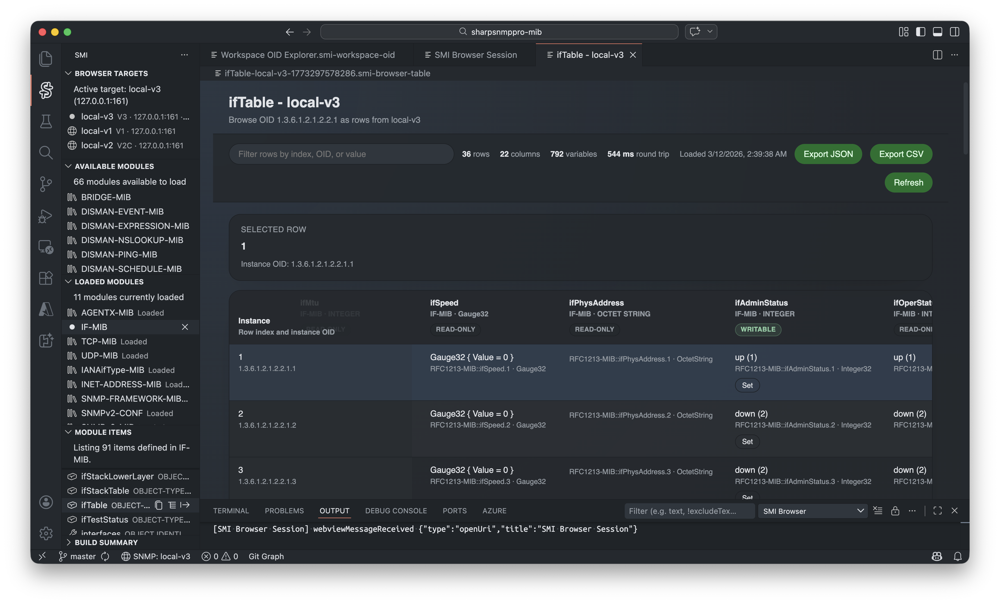
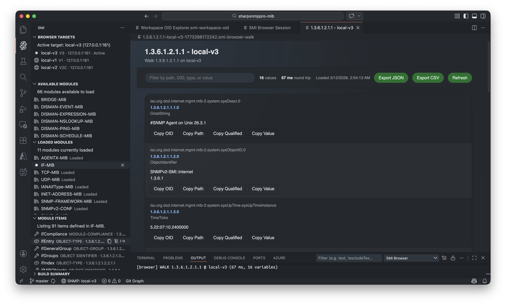

Reviewers' Guide — SNMP Studio for Visual Studio Code
=====================================================

Purpose
-------

This guide helps reviewers evaluate the SNMP Studio extension for Visual Studio Code.

Scope
-----

- Target audience: tool reviewers and professional engineers familiar with SNMP concepts.
- Platforms: macOS, Windows, Linux (verify on at least one OS).

Quick setup
-----------

1. Install the extension from the VS Code Marketplace (Community Edition) or load the VSIX from file system (Pro Edition).

   .. note::

      - The Community Edition is free and its `marketplace link is here <https://marketplace.visualstudio.com/items?itemName=lextudio.snmp-studio>`_.
      - The Pro Edition requires a license and can be obtained from the `C# SNMP website <https://www.sharpsnmp.com>`_.
         
2. Clone the `sharpsnmppro-mib` repository from GitHub into your workspace — these are the most reliable MIB documents for testing. Example commands:

.. code-block:: bash

   git clone https://github.com/lextudio/sharpsnmppro-mib.git

   # clone into a folder named `sharpsnmppro-mib` at your workspace root
3. Open a MIB file from the cloned repository to trigger the extension activation.
4. Confirm the language server is running and the extension activates on MIB files.

Feature walkthrough
-------------------

Syntax Highlighting and Navigation
~~~~~~~~~~~~~~~~~~~~~~~~~~~~~~~~~~

.. note::
   Features like navigation, hover, and diagnostics are only available in Pro Edition.

What to verify
- Tokens and semantic colors apply to MIB identifiers, types and keywords.
- Hover and semantic token refresh after edits.

Steps
1. Open a MIB from `sharpsnmppro-mib`.
2. Open SMI Language Server channel in the Output pane to confirm semantic highlighting is enabled.
3. Confirm syntax colors appear for OBJECT-TYPE, TEXTUAL-CONVENTION, and other keywords.
4. Hover symbols and check hover text and links to definitions.
5. Use Go to Definition and Find References on MIB identifiers to verify navigation works.
6. Make edits to see if diagnostics capture syntax errors.

Module Management
~~~~~~~~~~~~~~~~~

.. note::
   Features are only available in Pro Edition.

What to verify
- MIB files appear in the outline/module view; imports resolved.
- Ability to add/remove MIB module folders or refresh the index.
- Graph shows MIB module dependencies and allows node expansion.
- Learn about errors and warnings.

Steps
1. Load multiple MIBs (recommend using the `sharpsnmppro-mib` collection).
2. Verify module names appear in Available Modules pane.
3. Choose a few modules to load and see the updates in Loaded Module pane.
4. Select a loaded module and see its contents in Module Items pane.
5. Open the dependency graph for a selected module.
6. Inspect incoming/outgoing edges, expand nodes to reveal related modules.
7. From Build Summary pane, review any errors or warnings related to MIB loading and resolution.

OID Explorer
~~~~~~~~~~~~

.. note::
   Features are only available in Pro Edition.

What to verify
- Navigate through OID numbers and symbolic names, copy OID, view descriptions.

Steps
1. Open the Workspace OID Explorer pane.
2. Expand the tree and search for a symbol or numeric OID (such as ``sysDescr``).
3. Review its definitions from multile MIBs, copy the OID to clipboard, and navigate to its definition in the source MIB file.

AI Workflows
~~~~~~~~~~~~

... image:: _static/snmp-mcp.png
   :alt: AI workflows

.. note::
    Features are only available in Pro Edition.

What to verify
- Chat with your preferred AI assistant to get help with SNMP concepts, MIB authoring, or troubleshooting.

Steps
1. Open "Show MCP Setup Guide" command from the Command Palette.
2. Follow the instructions to connect SNMP MCP server to your AI assistant (e.g., GitHub Copilot,ChatGPT, Claude, etc).
3. Once connected, start a conversation with your AI assistant to ask questions about SNMP, get help with MIB authoring, or troubleshoot issues.

Message Session
~~~~~~~~~~~~~~~

.. note::
   Features are only available in Pro Edition.

What to verify
- Compose and send SNMP messages, preserve session history, and inspect responses.

Steps
1. Configure target SNMP agent and credentials in the Browser Targets pane.
2. Go to Workspace OID Explorer to find an OID.
3. Choose an operation (Get, Set) and start the message session.
4. Verify responses render and timestamps are recorded.

Table View
~~~~~~~~~~

.. note::
   Features are only available in Pro Edition.

What to verify
- Table structures render with columns; sorting and filtering work.

Steps
1. Open a table-type MIB node in the Workspace OID Explorer.
2. Choose the Table operation and start the message session.
3. Verify that the message session shows a partial table result with the link to a table view.
4. Open the table view and confirm columns, sorting, and filtering work as expected.

Walk View
~~~~~~~~~

.. note::
   Features are only available in Pro Edition.

What to verify
- Walk operations stream results incrementally and can be cancelled.

Steps
1. Open a MIB node in the Workspace OID Explorer.
2. Choose the Walk operation and start the message session.
3. Verify that partial results appear in the message session with the link to the Walk view.
4. Open the Walk view and confirm that results are nicely formatted.

Review checklist
----------------

- Extension activates for `.mib` and related files.
- Syntax highlighting and semantic tokens apply correctly.
- Language services: diagnostics, go-to-definition, hover.
- MIB/module management: imports resolved and outline accurate.
- OID Explorer: navigate, copy, jump to definition.
- Message session: compose, send, preserve history.
- Table view: columns, sorting, filtering.
- Walk view: listed results, filtering.

Functional test scenarios (suggested)
-----------------------------------

- Open a MIB from `sharpsnmppro-mib` and confirm semantic highlighting.
- Search for an OID in OID Explorer and navigate to its MIB source.
- Start an SNMP Walk against a simulated agent; verify incremental display and cancelability.
- Compose a `GetRequest` in Message Session and confirm response parsing.

Bug report template for reviewers
--------------------------------

- Summary: one-line description
- Steps to reproduce: environment, actions
- Expected: what should happen
- Actual: what happened (include logs and screenshots)
- Attachments: relevant MIBs, VSIX, workspace settings

Scoring rubric (simple)
-----------------------

- 5 — Excellent: no issues, docs clear, UX polished
- 4 — Good: minor issues or suggestions
- 3 — Acceptable: functional, but several UX or doc gaps
- 2 — Problematic: missing features or unstable interactions
- 1 — Blocker: critical failure or crash

Filing feedback
---------------

- Preferred: open issues in the repository with the `review` label.
- Include the module (extension, language server), OS, VS Code version, and attachments.

Next steps for the author
------------------------

- Link this guide from the main getting-started index.
- Ask reviewers to use the checklist and submit issues with the template above.

Acknowledgements
----------------

Thanks to the docs and screenshots contributors — this guide references the new `_static` images.
